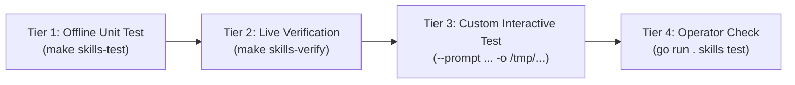

# Local Skill Development & Testing Guide

This guide describes how to develop, test, and verify OpenLia skills locally on your development machine **without deploying them to a running agent** or touching real user workspace data.

---

## 1. Core Principles & Environment Separation

When developing skills for OpenLia:
1. **Zero Production Contamination**: Test runs must never write to `/opt/data/workspace` or modify active user chats. Use dedicated isolated test paths (e.g. `/tmp/openlia_verify/`).
2. **No Running Agent Required**: You do **not** need Docker, the Hermes container, or the remote Raspberry Pi host active. All development and testing occurs via standalone Python scripts and local Playwright MCP.
3. **Layered Verification**: Skills are tested in four tiers, starting with sub-second offline unit tests up to live browser canary verification.

---

## 2. Skill Directory Structure

Every skill resides in [`profile/skills/<skill-name>/`](file:///Users/quangtran/Sync/learn-ai/open_lia/profile/skills/):

```
profile/skills/<skill-name>/
├── SKILL.md              # Frontmatter metadata (name, description, tags) and agent instructions
├── requirements.txt      # (Optional) Explicit pinned Python dependencies (e.g. PyYAML==6.0.2)
├── scripts/              # Standalone Python scripts executed by agent or developer
│   └── <helper>.py       # Must implement --self-test and execution modes
├── templates/            # (Optional) Domain Markdown templates
└── references/           # (Optional) Domain guidelines or rubrics
```

### Frontmatter Requirements (`SKILL.md`)
```yaml
---
name: skill-name
description: Clear 1-sentence summary of what the skill accomplishes.
version: 0.2.0
platforms: [linux, macos]
required_environment_variables: []
required_credential_files: []
metadata:
  hermes:
    tags: [personal-os, automation, category]
    category: automation
---
```

---

## 3. Dependency Management & Security Policy

OpenLia uses a permissive yet strictly governed dependency policy for skills:
- **Battle-Tested Libraries Preferred**: Rather than writing custom, fragile parsers or network implementations, skills are encouraged to leverage high-quality, standard ecosystem libraries (e.g., `PyYAML`, `pydantic`) for stable, predictable results.
- **Strict Version Pinning**: All dependencies must be explicitly pinned with exact versions (`==`) in the skill's own `requirements.txt` (e.g. `PyYAML==6.0.2`).
- **Aggregated Manifest**: Root [`requirements-dev.txt`](../requirements-dev.txt) aggregates all skill requirements into a single source of truth.
- **Reproducible Local Environment (`make venv`)**:
  Run `make venv` to create `.venv/` and install all requirements. The `Makefile` and operator CLI (`openlia skills test`) automatically detect and use `.venv/bin/python3` if present.
- **Container Synchronization**: When skills are deployed to the remote agent, [`docker/Dockerfile`](../docker/Dockerfile) automatically installs all declared skill requirements into the agent's `/opt/hermes/.venv`.

---

## 4. The 4-Tier Local Testing Hierarchy

OpenLia uses a 4-tier verification hierarchy to ensure skills can be continuously improved and tested without friction.



### Tier 1: Instant Offline Self-Tests (`--self-test`)
Every Python script in `profile/skills/*/scripts/*.py` must implement a deterministic `--self-test` flag that runs offline in under 0.1 seconds without browser, network, or external API dependencies.

```bash
# Test a specific skill script offline
python3 profile/skills/gemini-chat/scripts/gemini_conversation.py --self-test
python3 profile/skills/chatgpt-chat/scripts/chatgpt_conversation.py --self-test
python3 profile/skills/browser-pilot/scripts/check_browser_pilot.py --self-test

# Test all skill scripts across the entire repository (<0.5s)
make skills-test
```

**What it tests**: Argument parsing, URL cleaning/tracking stripping, metadata extraction, regex patterns, and YAML schema compliance.

---

### Tier 2: Live Browser Verification (`--verify`)
For browser-based skills, live verification tests the full end-to-end flow against a local browser session via Playwright MCP.

#### 1. Start the Local Playwright MCP Server
In a dedicated terminal, run the Playwright MCP server with the browser extension enabled:
```bash
npx @playwright/mcp@latest --host 127.0.0.1 --port 8931 --extension --idle-timeout 0 --shared-browser-context
```

#### 2. Run Live Verification
```bash
# Verify Gemini Chat live (verifies Temporary Chat toggle, prompt submit, Markdown extraction)
python3 profile/skills/gemini-chat/scripts/gemini_conversation.py --verify

# Verify ChatGPT Chat live
python3 profile/skills/chatgpt-chat/scripts/chatgpt_conversation.py --verify

# Verify Browser Pilot connectivity & tab listing
python3 profile/skills/browser-pilot/scripts/check_browser_pilot.py --verify

# Or verify all browser skills together
make skills-verify
```

> [!NOTE]
> **Browser Tab Lifecycle**: Each script run opens an isolated tab and closes it after successful completion via `browser_tabs(action="close")`. If an error or gatekeeper failure occurs, the worker resets the browser context before the next job. When running unattended, `enforce_tab_cap()` also prunes stale background tabs to prevent tab leaks.
>
> **Log Retention (`.playwright-mcp/`)**: `@playwright/mcp` generates console logs and accessibility snapshots under `.playwright-mcp/`. OpenLia includes an automated log pruner (`prune_playwright_mcp_logs()`) in all runners that evicts files older than 24h and caps the directory to 20 files. You can also run `make clean-logs` to flush all temporary logs on demand.

---

### Tier 3: Custom Interactive Query Simulation
You can test skills with arbitrary prompts and inspect the exact YAML output and citations without deploying:

```bash
# Send a custom prompt to Gemini and save to /tmp
python3 profile/skills/gemini-chat/scripts/gemini_conversation.py \
  --prompt "Explain Go 1.26 release highlights in 3 bullets." \
  --topic "Go 1.26 Highlights" \
  --output /tmp/test_gemini.yaml

# Inspect the resulting structured YAML
cat /tmp/test_gemini.yaml
```

```bash
# Send a custom prompt to ChatGPT and save to /tmp
python3 profile/skills/chatgpt-chat/scripts/chatgpt_conversation.py \
  --prompt "Compare Python dataclasses vs Pydantic v2 performance." \
  --topic "Dataclasses vs Pydantic" \
  --output /tmp/test_chatgpt.yaml

# Inspect the resulting structured YAML
cat /tmp/test_chatgpt.yaml
```

---

### Tier 4: Operator Contract Compatibility
OpenLia's operator CLI validates skills by extracting their scripts into an isolated temporary environment and running `--self-test`. Test this exactly as the operator does:

```bash
go run . skills test browser-pilot
go run . skills test chatgpt-chat
go run . skills test gemini-chat
```

---

## 4. Promotion & Deployment Pipeline

Once you have verified your changes across all 4 tiers locally, you can safely deploy the updated skills to your agent environments:

### Deploy to Local Dev Stack
```bash
make deploy-dev
# Equivalent to:
# OPENLIA_CONFIG=$HOME/.config/openlia/dev/openlia_dev.toml ./openlia deploy
```

### Promote to Production Stack (Remote Agent)
```bash
make deploy-prod
# Equivalent to:
# OPENLIA_CONFIG=$HOME/.config/openlia/config.toml ./openlia update openlia
```

Both deployment commands run `make skills-test` as an automatic pre-flight gate, ensuring broken or unverified skills are never deployed.
