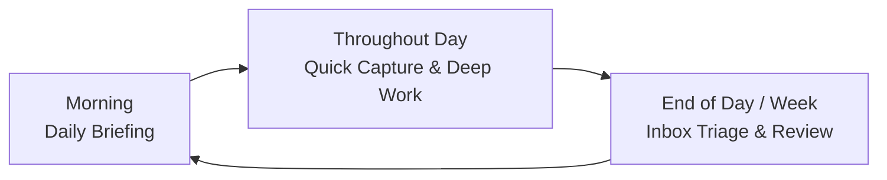

# OpenLia End User Guide

> A guide to daily life with your personal operating assistant.

OpenLia is your **Personal Operating Assistant**—a proactive, context-aware companion designed to help you turn scattered thoughts, goals, and daily context into clear decisions and deliberate action.

---

## 1. Understanding Your Roles

When working with OpenLia, there are two distinct roles:

```
+-------------------------------------------------------------------------+
|                            YOU (The Human)                              |
|                                                                         |
|  ┌───────────────────────────────────┐  ┌────────────────────────────┐  |
|  │        AS THE END USER            │  │      AS THE OPERATOR       │  |
|  │       (Daily Companion)           │  │   (System Administrator)   │  |
|  ├───────────────────────────────────┤  ├────────────────────────────┤  |
|  │ • Chat on Telegram or Open WebUI  │  │ • Runs `openlia` CLI       │  |
|  │ • Review morning briefings        │  │ • Deploys & updates server │  |
|  │ • Quick-capture notes & ideas     │  │ • Rotates API keys         │  |
|  │ • Track projects, goals, finances │  │ • Manages backups & health │  |
|  │ • Set boundaries in policy        │  │ • Troubleshoots containers │  |
|  └───────────────────────────────────┘  └────────────────────────────┘  |
+-------------------------------------------------------------------------+
```

- **The End User**: The person using Lia throughout the day to organize thoughts, plan projects, track health and finances, and make decisions. **This guide is for this role.**
- **The Operator**: The person managing the underlying servers, Docker containers, API keys, and backups using the `openlia` command-line tool. If you are also managing your own server, see the [Operator Guide](OPERATOR_GUIDE.md).

---

## 2. How You Interact With Lia

OpenLia supports multiple user interfaces depending on your preferred workflow:

### A. Telegram (Primary Mobile & Messaging Interface)
Telegram is typically the primary daily channel for mobile interactions.
- **Direct Messages (DMs)**: Chat one-on-one with your private bot. You can send text messages, share links, forward emails, or record voice notes.
- **Home Channel / Group**: A dedicated Telegram channel (e.g. "OpenLia Home") where Lia posts your scheduled morning briefings, automated monitor alerts, and periodic reviews.
- **Voice Notes**: Speak your mind on the go. Lia transcribes and captures your voice recordings into structured inbox notes.
- **Interactive Approvals**: When an action requires confirmation (such as modifying an external schedule or making an irreversible change), Lia prompts you in chat before executing.

### B. Open WebUI (Desktop Chat & Multi-Turn Discussions)
If your deployment enables Open WebUI (accessible at `http://localhost:8090` or via an SSH tunnel):
- Full-featured browser-based chat interface.
- Ideal for deep research sessions, structured brainstorming, reviewing lengthy drafts, and analyzing complex decision trade-offs.
- Retains local chat history while seamlessly delegating tasks to your workspace.

### C. Workspace UI (Document Browser & Editor)
If your deployment enables the Workspace UI (accessible at `http://localhost:8089` or via an SSH tunnel):
- Web-based explorer for your entire personal workspace.
- View Markdown files with live preview, examine YAML frontmatter, inspect Git status, and make direct manual edits.
- Built-in schema validation ensures you never accidentally break your structured records.

---

## 3. The Personal Workspace Model

Unlike traditional assistants where your context is locked away in vendor databases or ephemeral chat windows, OpenLia stores your life context in a **versioned, plain-text workspace** organized around durable concepts:

```text
workspace/
├── inbox/                  # Unsorted captures, links, and daily briefings
│   └── daily-briefing/     # Dated morning briefing reports (YYYY-MM-DD.md)
├── goals/                  # High-level personal & professional aspirations
├── areas/                  # Ongoing responsibilities (Health, Finances, Home, Career)
├── projects/               # Bounded efforts with milestones, deliverables, and tasks
├── decisions/              # Structured decision records with options and trade-offs
├── monitors/               # Watches for external changes (prices, flight alerts, feeds)
├── tasks/                  # Concrete action items linked to projects or areas
├── calendar/               # Event notes, agendas, and reminders (reminders.rem)
├── knowledge/              # Research notes, reference guides, and personal claims
│   └── claims/             # Verifiable personal facts with provenance and evidence
├── people/                 # Personal CRM, relationships, and context
├── shopping/               # Purchase candidates, research, and wishlists
├── travel/                 # Trips, itineraries, bookings, and packing lists
├── finance/                # Budgets, accounts, portfolio reviews, and intake logs
├── health/                 # Medical history, conditions, medications, and records
└── archive/                # Completed or inactive material kept for reference
```

### Structured Records and Schemas
Every record in your workspace uses standard Markdown with YAML frontmatter. For example, a project record (`projects/learn-rust.md`) looks like:

```markdown
---
$schema: ./project-template.schema.json
title: Learn Rust
status: in-progress
target_date: 2026-12-31
area: learning
---

## Objective
Build practical proficiency in Rust for systems programming.

## Milestones
- [x] Read The Rust Book
- [ ] Complete 100 exercises on Exercism
```

### The Claim Ledger (`knowledge/claims/`)
When you tell Lia something important about your life (e.g. *"I am allergic to penicillin"* or *"My passport expires on June 2028"*), Lia does not rely on transient LLM hallucinations. Instead, it writes a structured **Claim Record**:
- **Subject & Predicate**: The specific fact.
- **Evidence**: The message or document where this fact was stated.
- **Certainty**: Verified fact, direct report, observation, or hypothesis.
- **Temporal Validity**: When this fact took effect or expires.

---

## 4. Daily Life and Review Loops

OpenLia is designed to operate on a continuous cadence, keeping your digital life proactive rather than reactive.



### 1. Morning: The Daily Briefing (`/daily-briefing`)
Every morning (either on a schedule or when you ask `/daily-briefing`), Lia analyzes:
- Today's calendar events and meeting agendas.
- Urgent and high-priority tasks.
- Active monitors (e.g., flight price changes or tracked RSS items).
- Pending items in your `inbox/`.

Lia compiles a clean, focused briefing directly into `inbox/daily-briefing/YYYY-MM-DD.md` and sends a summary to your Telegram Home Channel or chat.

### 2. Throughout the Day: Frictionless Quick Capture
Never let an idea slip away. Whenever you think of something, find an interesting article, or receive a task:
- Send a quick text or voice note: *"Remember to check our car insurance renewal next Tuesday."*
- Forward a link: *"Read this article on distributed databases when planning our Q4 architecture."*
- Lia instantly drops the item into `inbox/` with timestamp and source metadata without interrupting your focus.

### 3. Triage & Organization (`/inbox-triage` & `/workspace-organize`)
When you have a few minutes:
- Say: *"Let's triage my inbox."*
- Lia reviews recent captures, suggests filing them into appropriate projects, areas, or tasks, and proposes links to relevant goals.
- Nothing moves without your agreement.

### 4. Periodic Reviews (`/weekly-review`, `/project-review`)
- **Weekly Review**: Every weekend, review progress across active projects, clear stagnant tasks, check upcoming calendar commitments, and ensure active goals have forward momentum.
- **Project Review**: Deep-dive into a specific project to re-evaluate milestones, risks, and next actions.
- **Personal Finance**: Review recent transaction batches in `finance/intake/` and reconcile against budgets.

### 5. Deep Research & Decision Analysis (`/deep-research`, `/decision-analysis`)
When faced with an important choice (e.g., evaluating a new job offer, selecting travel gear, or planning an itinerary):
- Ask: `"/decision-analysis should we rent or buy our next home?"`
- Lia creates a structured record in `decisions/`, researching options, compiling trade-offs, documenting constraints, and preserving the reasoning for future reflection.

---

## 5. Trust, Safety, and Approvals

Lia is governed by `assistant-policy.yaml`, located at the root of your personal workspace. This file defines what Lia is allowed to do autonomously versus what requires your explicit consent:

| Action Category | Default Authority | Behavior |
| :--- | :--- | :--- |
| **Reading & Analyzing Workspace** | Standing delegation | Lia reads notes, searches files, and synthesizes answers automatically. |
| **Writing to Inbox & Daily Reports** | Standing delegation | Lia creates daily briefings and captures incoming thoughts to `inbox/`. |
| **Updating Existing Workspace Files** | Standing delegation | Routine updates to tasks and project notes occur within registered domains. |
| **External Communications (Email/Chat)** | Explicit approval required | Lia prepares drafts and asks you to confirm before sending anything. |
| **Financial Transactions / Purchases** | Explicit approval required | Lia never buys products or moves funds autonomously. |
| **Destructive Actions / Deletions** | Explicit approval required | Lia never permanently deletes files or resets Git history without confirmation. |

You remain in complete control. If you ever want to narrow or expand Lia's authority, you can customize `assistant-policy.yaml` at any time.
